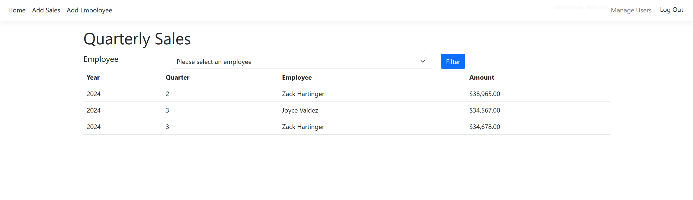
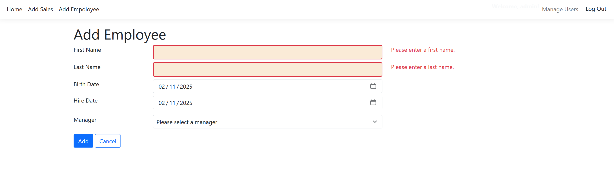
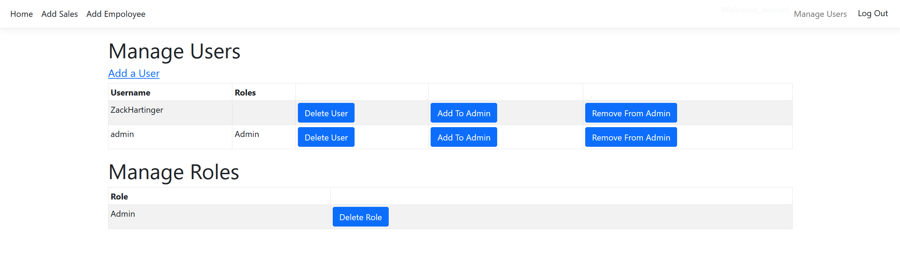
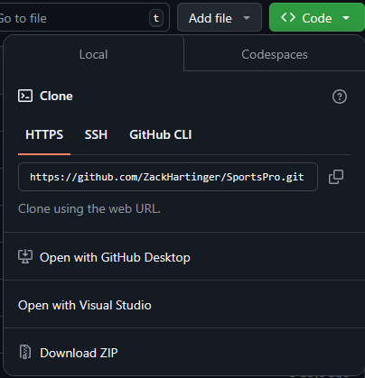
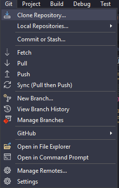
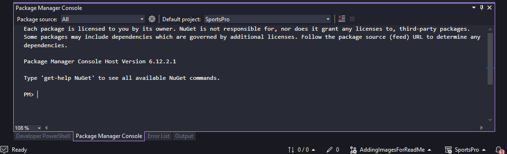

<h1>Quarterly Sales Application</h1>
<h3>An ASP.NET Core MVC app</h3>
<p>Features:</p>
<ul>
  <li>Authentication</li>
  <li>Role management</li>
  <li>Validation</li>
  <li>SQL Server Database</li>
  <li>Dependency Injection</li>
</ul>
<h2>About this project</h2>
<p>QuarterlySales is a simple application intended for adding employee sales data to a database and then using that data to track employee performance. Once a user has signed up they can add new employees and sales data. Users of the admin role are able to manage users by adding new users, deleting existing users, and grant users admin permissions.</p>

<div align="center">
  
</div>

<div align="center">
  
</div>

<div align="center">
  
</div>

<h2>How to run the program locally</h2>

<p>Software needed:</p>
<ul>
  <li>Visual Studio</li>
  <li>SQL Server Management Studio or another SQL database provider</li>
  <ul>
    <li>Please note that if using a different database, you will have to change the connection string found in appsetting.json to use your database and may need to add appropriate NuGet packages if using MySQL, Postrges, or a NoSQL database.</li>
  </ul>
</ul>

<h3>Step 1: Cloning the project repository</h3>
<p>Clone the repository by clicking the Code button in the top right corner. Select the HTTPS button and copy the link provided.</p>

<div align="center">
   
</div>

<p>Open Visual Studio and choose "continue without code" from the new project options.</p>
<p>Select Git in Visual Studio's toolbar and select the option to Clone a Repository. This will open a dialogue where you can paste the repositorie's url you copied earlier. Then, click the clone button in the bottom right corner.</p>
<div align="center" >
  
</div>

<h3>Step 2: Creating the database</h3>
<p>First, make changes to the connection string if not using SQL Server. The connection string can be found in appsettings.json. By default the connection string is set to a local instance of a SQL Server database.</p>
<p>While still in Visual Studio, navigate to the Package Manager console.</p>



<p>Run the following commmand:</p>


```
  update database
```
<p>If the database does not exist one will be created and Entity Framework will create all of the tables and add any records added in the configuration files.</p>

<h3>Step 3: Running the application</h3>
<p>Now that the database is set up, you can click run in Visual Studio and the app will launch in your default browser.</p>

> [!NOTE]
><p>By default there is only one user in the database. This user has admin permissions and you will need to log in using it's credentials to use all of the features of the application. The admin user's credentials are:</p>
><ul>
> <li>Username: admin</li>
>  <li>Password: Sesame</li>
></ul>

